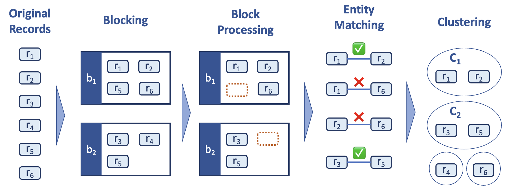

# SERF: Semantic Entity Resolution Framework

This project aims to provide a comprehensive framework for semantic entity resolution, enabling the identification and disambiguation of entities across various data sources. It is based on the blog post [The Rise of Semantic Entity Resolution](https://blog.graphlet.ai/the-rise-of-semantic-entity-resolution-45c48d5eb00a).

<div align="center">
    
    <p><em>Source: <a href="https://medium.com/data-science/entity-resolution-identifying-real-world-entities-in-noisy-data-3e8c59f4f41c">Entity Resolution: Identifying Real-World Entities in Noisy Data</a></em></p>
</div>

## Features

Phase 1 - Semantic Blocking

- **Semantic Clustering** - Clusters records using sentence embeddings to group them into efficient blocks for pairwise comparison at quadratic complexity.

Phase 2 - Schema Alignment, Matching and Merging with Large Language Models

- **Schema Alignment** - Aligns schemas of common entities with different formats
- **Entity Matching** - Matches entire blocks of records
- **Entity Merging** - Merges matched entities in entire blocks of records
- **Match Evaluation** - Evaluates the quality of matches using various metrics

All three operations occur in a single prompt guided by metadata from [DSPy](http://dspy.ai/) signatures, in [BAML](https://github.com/BoundaryML/baml) format with [Google Gemini models](https://ai.google.dev/gemini-api/docs/models).

Phase 3 - Edge Resolution

- **Edge Resolution** - Merging nodes results in duplicate edges.

## System Requirements

- Python 3.12
- Poetry for dependency management - see [POETRY.md](assets/POETRY.md) for installation instructions
- Java 11/17 (for Apache Spark)
- Apache Spark 3.5.5+
- 4GB+ RAM recommended (for Spark processing)

### Quick Start

1. Clone the repository:

```bash
git clone https://github.com/Graphlet-AI/serf.git
cd serf
```

2. Create a conda / virtual environment:

In `conda`:

```bash
conda create -n serf python=3.12
conda activate serf
```

With `venv`:

```bash
python -m venv venv
source venv/bin/activate
```

3. Install dependencies:

```bash
poetry install
```

4. Install pre-commit checks:

```bash
pre-commit install
```

## CLI

The SERF CLI provides commands for running the entity resolution pipeline:

```bash
$ serf --help
Usage: serf [OPTIONS] COMMAND [ARGS]...

  SERF: Semantic Entity Resolution Framework CLI.

Options:
  --version  Show the version and exit.
  --help     Show this message and exit.

Commands:
  block  Perform semantic blocking on input data.
  edges  Resolve edges after node merging.
  match  Align schemas, match entities, and merge within blocks.
```

### Docker Setup

The easiest way to get started with SERF is using Docker and `docker compose`. This ensures a consistent development environment.
