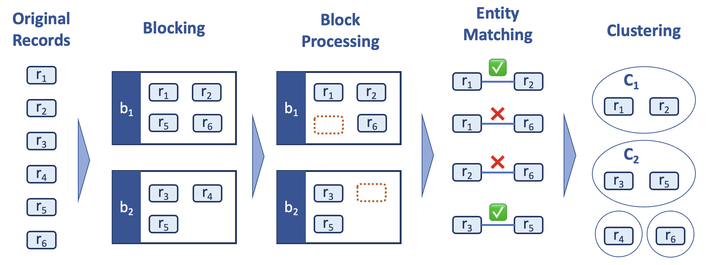

# SERF: Agentic Semantic Entity Resolution Framework

[](LICENSE)
[](https://python.org)

SERF is an open-source framework for **semantic entity resolution** — identifying when two or more records refer to the same real-world entity using large language models, sentence embeddings, and agentic AI.

SERF runs multiple rounds of entity resolution until the dataset converges to a stable state, with DSPy agents controlling all phases dynamically.

<div align="center">
    
    <p><em>Source: <a href="https://medium.com/data-science/entity-resolution-identifying-real-world-entities-in-noisy-data-3e8c59f4f41c">Entity Resolution: Identifying Real-World Entities in Noisy Data</a></em></p>
</div>

## Features

### Phase 0 — Agentic Control

DSPy ReAct agents dynamically orchestrate the entire pipeline, adjusting blocking parameters, selecting matching strategies, and deciding when convergence is reached.

### Phase 1 — Semantic Blocking

Clusters records using **Qwen3 sentence embeddings** and **FAISS IVF** to create efficient blocks for comparison. Auto-scales block size across iterations.

### Phase 2 — Schema Alignment, Matching and Merging

All three operations in a single LLM prompt via **DSPy signatures** with the **BAMLAdapter** for structured output formatting. Block-level matching lets the LLM see all records simultaneously for holistic decisions.

### Phase 3 — Edge Resolution

For knowledge graphs: deduplicate edges that result from merging nodes using LLM-guided intelligent merging.

## Architecture

| Component          | Technology                                         |
| ------------------ | -------------------------------------------------- |
| Package Manager    | **uv**                                             |
| Data Processing    | **PySpark 4.x**                                    |
| LLM Framework      | **DSPy 3.x** with BAMLAdapter                      |
| Embeddings         | **multilingual-e5-base** via sentence-transformers |
| Vector Search      | **FAISS IndexIVFFlat**                             |
| Linting/Formatting | **Ruff**                                           |
| Type Checking      | **zuban** (mypy-compatible)                        |

## Quick Start

### Installation

```bash
git clone https://github.com/Graphlet-AI/serf.git
cd serf
uv sync --extra dev
```

### System Requirements

- Python 3.12+
- Java 11/17/21 (for PySpark)
- 4GB+ RAM recommended

### CLI Usage

```bash
# Profile a dataset
serf analyze --input data/companies.parquet

# Run the full ER pipeline
serf resolve --input data/entities.csv --output data/resolved/ --iteration 1

# Run individual phases
serf block --input data/entities.csv --output data/blocks/ --method semantic
serf match --input data/blocks/ --output data/matches/ --iteration 1
serf eval --input data/matches/

# Benchmark against standard datasets
serf download --dataset dblp-acm
serf benchmark --dataset dblp-acm --output data/results/
```

### Python API

```python
from serf.block.pipeline import SemanticBlockingPipeline
from serf.match.matcher import EntityMatcher
from serf.eval.metrics import evaluate_resolution

# Block
pipeline = SemanticBlockingPipeline(target_block_size=50)
blocks, metrics = pipeline.run(entities)

# Match
matcher = EntityMatcher(model="gemini/gemini-2.0-flash")
resolutions = await matcher.resolve_blocks(blocks)

# Evaluate
metrics = evaluate_resolution(predicted_pairs, ground_truth_pairs)
```

### DSPy Interface

```python
import dspy
from serf.dspy.signatures import BlockMatch
from serf.dspy.baml_adapter import BAMLAdapter

lm = dspy.LM("gemini/gemini-2.0-flash", api_key=GEMINI_API_KEY)
dspy.configure(lm=lm, adapter=BAMLAdapter())

matcher = dspy.ChainOfThought(BlockMatch)
result = matcher(block_records=block_json, schema_info=schema, few_shot_examples=examples)
```

## Benchmark Results

Performance on standard ER benchmarks from the [Leipzig Database Group](https://dbs.uni-leipzig.de/research/projects/benchmark-datasets-for-entity-resolution). Blocking uses multilingual-e5-base name-only embeddings + FAISS IVF. Matching uses Gemini 2.0 Flash via DSPy BlockMatch.

| Dataset      | Domain        | Left  | Right | Matches | Precision | Recall | F1         |
| ------------ | ------------- | ----- | ----- | ------- | --------- | ------ | ---------- |
| **DBLP-ACM** | Bibliographic | 2,616 | 2,294 | 2,224   | 0.8849    | 0.5809 | **0.7014** |

Blocking uses name-only embeddings for tighter semantic clusters. All matching decisions are made by the LLM — no embedding similarity thresholds.

## Project Structure

```
src/serf/
├── cli/             # Click CLI commands
├── dspy/            # DSPy types, signatures, agents, adapter
├── block/           # Semantic blocking (embeddings, FAISS, normalization)
├── match/           # UUID mapping, LLM matching, few-shot examples
├── merge/           # Field-level entity merging
├── edge/            # Edge resolution for knowledge graphs
├── eval/            # Metrics, benchmark datasets
├── analyze/         # Dataset profiling, field detection
├── spark/           # PySpark schemas, utils, Iceberg, graph components
├── config.py        # Configuration management
└── logs.py          # Logging
```

## Configuration

All configuration is centralized in `config.yml`:

```python
from serf.config import config
model = config.get("models.llm")  # "gemini/gemini-2.0-flash"
block_size = config.get("er.blocking.target_block_size")  # 50
```

## Development

```bash
# Install dependencies
uv sync

# Run tests
uv run pytest tests/

# Lint and format
uv run ruff check --fix src tests
uv run ruff format src tests

# Type check
uv run zuban check src tests

# Pre-commit hooks
pre-commit install
pre-commit run --all-files
```

## References

1. Jurney, R. (2024). "[The Rise of Semantic Entity Resolution](https://towardsdatascience.com/the-rise-of-semantic-entity-resolution/)." _Towards Data Science_.
2. Khattab, O. et al. (2024). "DSPy: Compiling Declarative Language Model Calls into Self-Improving Pipelines." _ICLR 2024_.
3. Li, Y. et al. (2021). "Ditto: A Simple and Efficient Entity Matching Framework." _VLDB 2021_.
4. Mudgal, S. et al. (2018). "Deep Learning for Entity Matching: A Design Space Exploration." _SIGMOD 2018_.
5. Papadakis, G. et al. (2020). "Blocking and Filtering Techniques for Entity Resolution: A Survey." _ACM Computing Surveys_.

## License

Apache License 2.0. See [LICENSE](LICENSE) for details.
