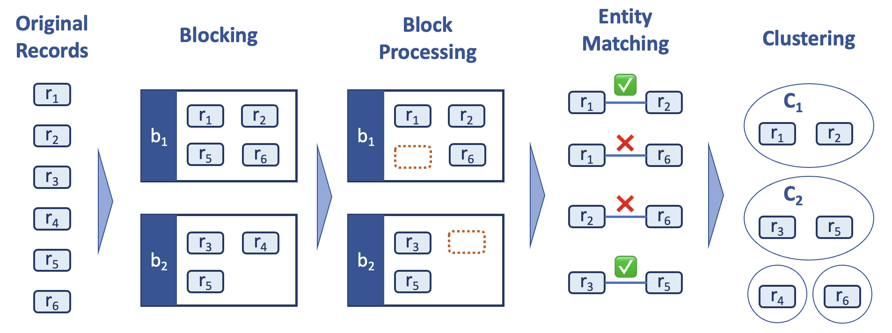

# SERF: Agentic Semantic Entity Resolution Framework

[](LICENSE)
[](https://python.org)

SERF is an open-source framework for **semantic entity resolution** — identifying when two or more records refer to the same real-world entity using large language models, sentence embeddings, and agentic AI.

SERF runs multiple rounds of entity resolution until the dataset converges to a stable state, with DSPy agents controlling all phases dynamically.

<div align="center">
    
    <p><em>Source: <a href="https://medium.com/data-science/entity-resolution-identifying-real-world-entities-in-noisy-data-3e8c59f4f41c">Entity Resolution: Identifying Real-World Entities in Noisy Data</a></em></p>
</div>

## Features

### Phase 0 — Agentic Control

DSPy ReAct agents dynamically orchestrate the entire pipeline, adjusting blocking parameters, selecting matching strategies, and deciding when convergence is reached.

### Phase 1 — Semantic Blocking

Clusters records using **bge-small-en-v1.5 sentence embeddings** and **FAISS IVF** to create efficient blocks for comparison. Auto-scales block size across iterations. Records can be embedded as JSON with all field names inline instead of by name with `--blocking-strategy json`.

### Phase 2 — Schema Alignment, Matching and Merging

All three operations in a single LLM prompt via **DSPy signatures** with **`dspy.XMLAdapter`** for structured output formatting. Block-level matching lets the LLM see all records simultaneously for holistic decisions.

### Phase 3 — Edge Resolution

For knowledge graphs: deduplicate edges that result from merging nodes using LLM-guided intelligent merging.

## Architecture

| Component          | Technology                                      |
| ------------------ | ----------------------------------------------- |
| Package Manager    | **uv**                                          |
| Data Processing    | **PySpark 4.x**                                 |
| LLM Framework      | **DSPy 3.x** with `XMLAdapter`                  |
| Embeddings         | **bge-small-en-v1.5** via sentence-transformers |
| Vector Search      | **FAISS IndexIVFFlat**                          |
| Linting/Formatting | **Ruff**                                        |
| Type Checking      | **zuban** (mypy-compatible)                     |

## Quick Start

### Installation

```bash
git clone https://github.com/Graphlet-AI/serf.git
cd serf
uv sync --extra dev
```

### Docker

```bash
# Build
docker compose build

# Run any serf command
docker compose run serf benchmark --dataset dblp-acm

# Run benchmarks
docker compose --profile benchmark up

# Run tests
docker compose --profile test up

# Analyze a dataset (put your file in data/)
docker compose run serf analyze --input data/input.csv --output data/er_config.yml
```

Set your API keys in a `.env` file or export them:

```bash
echo "GEMINI_API_KEY=your-key" > .env
echo "VERTEX_AI_TOKEN=your-vertex-token" >> .env
echo "GOOGLE_CLOUD_PROJECT=your-gcp-project" >> .env
```

### System Requirements

- Python 3.12+
- Java 11/17/21 (for PySpark)
- 4GB+ RAM recommended

### CLI Usage

```bash
# Profile a dataset
serf analyze --input data/companies.parquet

# Run the full ER pipeline
serf resolve --input data/entities.csv --output data/resolved/ --iteration 1

# Run individual phases
serf block --input data/entities.csv --output data/blocks/ --method semantic
serf match --input data/blocks/ --output data/matches/ --iteration 1
serf eval --input data/matches/

# Benchmark against standard datasets
# (walmart-amazon, abt-buy, amazon-google, dblp-acm, dblp-scholar)
serf download --dataset dblp-acm
serf benchmark --dataset dblp-acm --output data/results/

# Each run does er.max_iterations rounds (3 by default): every round re-blocks
# the entities merged by the previous one, so records the first round of
# blocking kept apart get another chance to meet. Override per run:
serf benchmark --dataset dblp-acm --max-iterations 1 --output data/results/

# Match with the typed signature written for one dataset instead of the shared
# BlockMatch signature, on a 1000-record sample drawn by ground-truth match group
serf benchmark --dataset dblp-acm --signature-mode per-dataset \
  --sample-records 1000 --seed 42 --output data/results/

# Exploratory analysis of the benchmark datasets, in Spark SQL and with no LLM
# calls. Reports attribute discriminativeness, common values, how often each
# attribute agrees on a true match against the hardest non-matches, and worked
# examples of both. This is what BENCHMARKS.md is built from
serf profile-benchmark --dataset abt-buy --output data/abt_buy_profile.md

# Compare embedding models on blocking recall alone, no LLM calls and no cost.
# Candidates default to benchmarks.embedding_candidates in config.yml
serf blocking-sweep --dataset dblp-acm --output data/blocking_sweep.json

# Sweep the large candidates instead, scoring name blocking, JSON blocking and
# the union of the two, with the pair count each would hand the matcher
serf blocking-sweep --candidate-set large --blocking-strategy all --sample 2000 \
  --output data/blocking_sweep_large.json

# Rank candidate embeddings by their published MTEB scores, and check which
# category actually orders them the way measured blocking recall does
serf mteb-rank --candidate-set all --sweep data/blocking_sweep_large.json

# Block twice, on the name and on the whole record as JSON, and keep both sets
# of blocks so a pair only has to be caught by one of them
serf benchmark --dataset amazon-google --blocking-strategy union \
  --sample-records 1000 --output data/results/

# Optimize ER signatures with GEPA (GPT OSS 120b student, Gemini 3.5 Flash-Lite teacher)
# Randomly samples 2000 train / 1000 val / 1000 holdout records, keeping
# ground-truth match groups whole so gold pairs survive, then blocks within
# each split to build the BlockMatch examples. Val is filled first.
serf optimize --dataset dblp-acm --signature block-match

# Show the signatures and prompts matching actually sends, before any tuning.
# A signature's docstring is its prompt, so this prints the instructions, the
# field list and the XML skeleton the answer has to fill. Makes no LLM call
serf prompts --dataset abt-buy
serf prompts --output data/signatures.md

# Optimize the per-dataset signature with GEPA, which is the prompt the
# benchmark runs. `serf optimize` covers the shared BlockMatch, EntityMerge and
# EdgeResolve signatures instead. Writes to optimize.trained_dir
serf train --dataset dblp-acm --auto light

# Then measure the trained prompt end to end, and read what GEPA wrote
serf benchmark --dataset dblp-acm --signature-mode per-dataset --trained-prompts \
  --sample-records 1000 --seed 42
serf prompts --dataset dblp-acm --trained --instructions-only
```

### Python API

```python
from serf.block.pipeline import SemanticBlockingPipeline
from serf.match.matcher import EntityMatcher
from serf.eval.metrics import evaluate_resolution

# Block
pipeline = SemanticBlockingPipeline(target_block_size=50)
blocks, metrics = pipeline.run(entities)

# Match
matcher = EntityMatcher(model="openai/gpt-oss-120b-maas")
resolutions = await matcher.resolve_blocks(blocks)

# Evaluate
metrics = evaluate_resolution(predicted_pairs, ground_truth_pairs)
```

### DSPy Interface

```python
import dspy
from serf.dspy.signatures import BlockMatch

from serf.dspy.lm import create_lm

lm = create_lm(role="student")  # openai/gpt-oss-120b-maas via VERTEX_AI_TOKEN
dspy.configure(lm=lm, adapter=dspy.XMLAdapter())

matcher = dspy.ChainOfThought(BlockMatch)
result = matcher(block_records=block_json, schema_info=schema, few_shot_examples=examples)
```

### Per-Dataset Typed Signatures

`BlockMatch` describes one anonymous `Entity` type and is shared by every dataset.
Each benchmark match task also has its own signature with two typed side models,
one per source, whose field descriptions come from the entity resolution
literature for that task. Select them with `--signature-mode per-dataset`.

```python
from serf.dspy.dataset_signatures import get_dataset_spec
from serf.match.dataset_matcher import DatasetMatcher

spec = get_dataset_spec("walmart-amazon")  # WalmartProduct / AmazonElectronicsProduct
resolutions = await DatasetMatcher("walmart-amazon").resolve_blocks(blocks)
```

## Benchmark Results

Performance on standard ER benchmarks from the [Leipzig Database Group](https://dbs.uni-leipzig.de/research/projects/benchmark-datasets-for-entity-resolution). Matching uses GPT OSS 120b (Vertex AI MaaS) as the student/task LM via DSPy BlockMatch, with Gemini 3.5 Flash-Lite as the teacher/reflection LM for GEPA.

What each of these datasets actually contains — its quirks, its common values, which attributes
carry signal, and real examples of the match and mismatch patterns a prompt has to handle — is
written up one page per dataset in [BENCHMARKS.md](BENCHMARKS.md), alongside the lessons from the
two technical reports that defined them.

These rows were measured with the former multilingual-e5-base default, before the FAISS cluster-count fix and before the XML adapter fix, so they understate what the current config reaches — see [Blocking Recall](#blocking-recall) for the gap and `experiments/embedding-blocking-sweep.md` for the measurements.

| Dataset      | Domain        | Left  | Right | Matches | Precision | Recall | F1         |
| ------------ | ------------- | ----- | ----- | ------- | --------- | ------ | ---------- |
| **DBLP-ACM** | Bibliographic | 2,616 | 2,294 | 2,224   | 0.8849    | 0.5809 | **0.7014** |

Blocking embeds the name alone by default, for tighter semantic clusters; `--blocking-strategy union`
adds a second blocking over the whole record as JSON and keeps both. All matching decisions are made by
the LLM — no embedding similarity thresholds.

Every number below the full-table row is post-fix. Until recently `dspy.XMLAdapter` rejected 27 of every
33 blocks over unescaped ampersands and XML's missing null literal, which sent them through DSPy's JSON
fallback at double the inference cost and lost the ones the fallback also failed. The investigation and
the before/after are in [experiments/xml-adapter-block-loss.md](experiments/xml-adapter-block-loss.md).

### Against the Public Leaderboard

The standard entity resolution scoreboard is the Papers With Code [Entity Resolution](https://paperswithcode.com/task/entity-resolution)
task. Papers With Code was sunset in 2025 and now redirects to Hugging Face, so the live mirror of
those boards is [OpenCodePapers](https://opencodepapers-b7572d.gitlab.io/benchmarks/entity-resolution-on-abt-buy.html).
SERF is a 1,000-record sample at seed 42, three ER iterations, `--signature-mode per-dataset`,
`gpt-oss-120b` matching, no training.

| Model                  | Abt-Buy F1 | Task                      | Trained on the benchmark |
| ---------------------- | ---------- | ------------------------- | ------------------------ |
| gpt4-0613 zero-shot    | 95.78      | pair classification       | no                       |
| RoBERTa-SupCon         | 94.29      | pair classification       | yes                      |
| gpt-4o-mini fine-tuned | 94.09      | pair classification       | yes                      |
| **SERF gpt-oss-120b**  | **92.49**  | **end-to-end resolution** | **no**                   |
| gpt-4o-2024-08-06      | 92.20      | pair classification       | no                       |
| RobEM                  | 90.90      | pair classification       | yes                      |
| HierGAT                | 89.80      | pair classification       | yes                      |
| Ditto                  | 89.33      | pair classification       | yes                      |
| gpt-4o-mini            | 87.68      | pair classification       | no                       |
| Llama-3.1-70B          | 79.12      | pair classification       | no                       |

The comparison is indicative, not like-for-like. Every leaderboard entry scores pair classification:
the candidate pairs are handed to the model and it labels each one. SERF does the whole task, so its
recall carries every pair blocking never proposed, which a pair classifier never pays for. Read the
row as "end-to-end, untrained, in the neighbourhood of an unfine-tuned frontier model", not as a rank.

The row moved up from 90.38, which was measured with the shared `BlockMatch` signature before the
per-dataset signatures existed. Two changes account for the difference and both are recorded
elsewhere in this README: the typed per-dataset signatures rewritten from the `BENCHMARKS.md`
profiling, and running the three ER iterations the pipeline is designed around. A single pass scores
0.8413 on the same sample, because one matching pass can only pair records blocking already put
together — which is also why single-pass blocking recall of 0.8912 is not the ceiling it looks like.
Re-blocking the entities merged by the previous round gives separated records another chance to meet,
and end-to-end recall here reaches 0.9094.

### Blocking Recall

Blocking recall is the share of ground-truth pairs whose two records land in the same block. Matching
never sees the rest, so this is a hard ceiling on end-to-end recall. Measured with `serf blocking-sweep`
on the full tables, one pass, `target_block_size: 30`. Full results and the two blocking bugs this
uncovered are in [experiments/embedding-blocking-sweep.md](experiments/embedding-blocking-sweep.md).

| Embedding                         | DBLP-ACM | DBLP-Scholar | Abt-Buy | Amazon-Google | Walmart-Amazon | Mean       | Embed secs |
| --------------------------------- | -------- | ------------ | ------- | ------------- | -------------- | ---------- | ---------- |
| **bge-small-en-v1.5** _(default)_ | 0.9654   | 0.9048       | 0.8952  | 0.6512        | 0.8545         | **0.8542** | **273**    |
| gte-base                          | 0.9708   | 0.9211       | 0.8724  | 0.6821        | 0.8514         | 0.8595     | 661        |
| gte-small                         | 0.9604   | 0.9233       | 0.8824  | 0.6410        | 0.8410         | 0.8496     | 228        |
| bge-base-en-v1.5                  | 0.9856   | 0.9020       | 0.8569  | 0.6461        | 0.8545         | 0.8490     | 898        |
| all-MiniLM-L6-v2                  | 0.9717   | 0.9205       | 0.8551  | 0.6435        | 0.7775         | 0.8337     | 133        |
| all-mpnet-base-v2                 | 0.9793   | 0.9278       | 0.8323  | 0.6590        | 0.7391         | 0.8275     | 697        |
| multilingual-e5-base _(former)_   | 0.9735   | 0.8898       | 0.8724  | 0.5047        | 0.8025         | 0.8086     | 718        |

`gte-base` edges out the default by 0.005 mean recall for 2.4x the embedding time. Blocking re-embeds
every record on every ER round, so the smaller model is the better default; set `models.embedding` to
trade back.

### Large Embeddings Do Not Pay

Large candidates were chosen from MTEB(eng, v2) _clustering_ — the task category blocking appears to
perform — among models within 3B parameters and 1,024 dimensions. Measured on 2,000-record samples
per dataset, name-only blocking, one pass. Full protocol, the JSON results and the four large models
that will not run on transformers 5.16 are in
[experiments/low-high-embeddings-and-json-blocking.md](experiments/low-high-embeddings-and-json-blocking.md).

| Embedding                         | DBLP-ACM   | DBLP-Scholar | Abt-Buy    | Walmart-Amazon | Amazon-Google | Mean       | Embed secs |
| --------------------------------- | ---------- | ------------ | ---------- | -------------- | ------------- | ---------- | ---------- |
| mxbai-embed-large-v1              | 0.9904     | **0.9744**   | **0.9001** | **0.9236**     | 0.6323        | **0.8842** | 291        |
| **bge-small-en-v1.5** _(default)_ | 0.9745     | 0.9659       | 0.8912     | 0.8750         | **0.6756**    | 0.8765     | **47**     |
| multilingual-e5-large-instruct    | **0.9947** | 0.9455       | 0.8952     | 0.9028         | 0.6143        | 0.8705     | 334        |
| bge-large-en-v1.5                 | 0.9936     | 0.9489       | 0.8813     | 0.8750         | 0.6338        | 0.8665     | 324        |
| F2LLM-0.6B                        | 0.9172     | 0.8944       | 0.7636     | 0.7708         | 0.5979        | 0.7888     | 183        |
| Qwen3-Embedding-0.6B              | 0.9299     | 0.8739       | 0.7280     | 0.7847         | 0.6099        | 0.7853     | 186        |

Going big does not buy blocking recall. Only one large model beats the 33M default, by 0.0077 for six
times the CPU, and two finish below it. This is why there is one blocking embedding rather than a
small and a large tier: the large one lost on the mean and cost six times the CPU to do it. A large
model only leads on the bibliographic datasets, `bge-large-en-v1.5` by 0.019 on DBLP-ACM, which is
not worth a second code path. Point `models.embedding` at another model to trade.

### Which MTEB Category Predicts Blocking Recall

Clustering was the wrong category to select candidates on, and this is now measured rather than
suspected. `serf mteb-rank` reads published scores from the `mteb/results` dataset, averages the tasks
in a category, and correlates that against measured blocking recall. Run over all thirteen candidates
on one set of 2,000-record samples, so the MTEB rank and the measurement are compared on the same
footing:

| MTEB(eng, v2) category | Spearman, 13 models | Spearman, 18 models |
| ---------------------- | ------------------- | ------------------- |
| **PairClassification** | **+0.5714**         | **+0.5129**         |
| STS                    | +0.0879             | +0.2322             |
| Classification         | +0.0220             | +0.1208             |
| Clustering             | +0.0165             | +0.0941             |
| Reranking              | +0.0165             | +0.3044             |
| Retrieval              | −0.0549             | +0.1662             |

The 18-model column adds the candidates the matching category surfaced, below. PairClassification
stays first and clustering stays last.

Clustering carries no information about blocking recall at all. It would have ranked `F2LLM-0.6B` and
`Qwen3-Embedding-0.6B` first and second of the thirteen; they measure last and second from last.
PairClassification is the only category with signal, and the reason is that it is the matching
category: SprintDuplicateQuestions, TwitterSemEval2015 and TwitterURLCorpus all ask whether two short
texts denote the same thing, scored by average precision over cosine similarity, which is the entity
matching decision. It ranks `F2LLM-0.6B` last, and its top pick is `mxbai-embed-large-v1`, the best
large model measured.

```bash
serf mteb-rank --candidate-set all --sweep data/blocking_sweep.json
```

The measured table on those shared samples, best instruction prefix per model:

| Embedding                         | DBLP-ACM   | DBLP-Scholar | Abt-Buy    | Amazon-Google | Walmart-Amazon | Mean       | Embed secs |
| --------------------------------- | ---------- | ------------ | ---------- | ------------- | -------------- | ---------- | ---------- |
| gte-base                          | 0.9841     | **0.9779**   | **0.9179** | **0.7100**    | 0.9028         | **0.8985** | 86         |
| mxbai-embed-large-v1              | 0.9904     | 0.9744       | 0.9001     | 0.6323        | **0.9236**     | 0.8842     | 294        |
| gte-small                         | 0.9904     | 0.9370       | 0.9100     | 0.6697        | 0.9097         | 0.8834     | 44         |
| bge-base-en-v1.5                  | 0.9841     | 0.9659       | 0.8853     | 0.6487        | 0.9097         | 0.8787     | 111        |
| **bge-small-en-v1.5** _(default)_ | 0.9745     | 0.9659       | 0.8912     | 0.6756        | 0.8750         | 0.8765     | **47**     |
| multilingual-e5-large-instruct    | **0.9947** | 0.9455       | 0.8952     | 0.6143        | 0.9028         | 0.8705     | 355        |
| bge-large-en-v1.5                 | 0.9936     | 0.9489       | 0.8813     | 0.6338        | 0.8750         | 0.8665     | 315        |
| all-mpnet-base-v2                 | 0.9915     | 0.9727       | 0.8853     | 0.6203        | 0.8403         | 0.8620     | 90         |
| all-MiniLM-L6-v2                  | 0.9639     | 0.9574       | 0.8408     | 0.6173        | 0.8681         | 0.8495     | 34         |
| multilingual-e5-base              | 0.9798     | 0.9727       | 0.8724     | 0.5546        | 0.8056         | 0.8370     | 200        |
| multilingual-e5-small             | 0.9798     | 0.9455       | 0.8417     | 0.5725        | 0.7917         | 0.8262     | 54         |
| F2LLM-0.6B                        | 0.9289     | 0.8910       | 0.7596     | 0.5859        | 0.7708         | 0.7873     | 188        |
| Qwen3-Embedding-0.6B              | 0.9299     | 0.8705       | 0.7250     | 0.5755        | 0.7986         | 0.7799     | 207        |

A correlation of 0.57 is worth selecting candidates on and is not worth trusting instead of measuring.
PairClassification's own top pick finishes second, and the model that actually wins, `gte-base`, is
only sixth on it. The ordering is not even stable across record sets: `gte-small` beats the default by
0.0069 on these samples and loses to it by 0.0046 on the full tables. Use the matching category to
choose what to sweep, then sweep it.

### Selecting Candidates on the Matching Category

Taking the top PairClassification scorers inside 3B parameters and 1,024 dimensions surfaces five
models that the clustering ranking never did. Four of the five beat every clustering-selected large
model, and the best of them sets a new ceiling on four of the five datasets:

| Embedding                         | Selected on             | DBLP-ACM | DBLP-Scholar | Abt-Buy    | Amazon-Google | Walmart-Amazon | Mean       | Embed secs |
| --------------------------------- | ----------------------- | -------- | ------------ | ---------- | ------------- | -------------- | ---------- | ---------- |
| **GIST-large-Embedding-v0**       | **PairClassification**  | 0.9820   | **0.9813**   | 0.9149     | 0.7070        | **0.9306**     | **0.9031** | 250        |
| gte-base                          | clustering-era sweep    | 0.9841   | 0.9779       | **0.9179** | 0.7100        | 0.9028         | 0.8985     | **86**     |
| **b1ade-embed**                   | **PairClassification**  | 0.9904   | 0.9830       | 0.8872     | **0.7130**    | 0.9097         | 0.8967     | 245        |
| **gte-modernbert-base**           | **PairClassification**  | 0.9830   | 0.9761       | 0.8912     | 0.6607        | **0.9306**     | 0.8883     | 111        |
| **UAE-Large-V1**                  | **PairClassification**  | 0.9915   | 0.9710       | 0.8912     | 0.6741        | 0.9028         | 0.8861     | 248        |
| mxbai-embed-large-v1              | clustering              | 0.9904   | 0.9744       | 0.9001     | 0.6323        | 0.9236         | 0.8842     | 294        |
| **bge-small-en-v1.5** _(default)_ | clustering-era sweep    | 0.9745   | 0.9659       | 0.8912     | 0.6756        | 0.8750         | 0.8765     | 47         |
| bge-large-en-v1.5                 | clustering              | 0.9936   | 0.9489       | 0.8813     | 0.6338        | 0.8750         | 0.8665     | 315        |
| **ember-v1**                      | **PairClassification**  | 0.9915   | 0.9710       | 0.7953     | 0.6413        | 0.9028         | 0.8604     | 245        |
| F2LLM-0.6B                        | clustering _(ranked 1)_ | 0.9289   | 0.8910       | 0.7596     | 0.5859        | 0.7708         | 0.7873     | 188        |

`avsolatorio/GIST-large-Embedding-v0` beats `bge-large-en-v1.5` by 0.0366 mean blocking recall while
embedding faster, 250s against 315s, making it the first large model to dominate that model on both
axes. `ember-v1` is the counterexample that keeps the correlation honest: it outscores all of
them on PairClassification at 87.37 and finishes below all of them, because it collapses on Abt-Buy.

`KiteFishAI/Nano-Em1-0.6B-v2.1` leads PairClassification outright at 89.9 and could not be measured:
it is an LLM-based embedder whose tokenizer ships no chat template, so `sentence-transformers` refuses
to load it.

### Name, JSON and the Union of Both

`--blocking-strategy json` embeds every populated field as a JSON object with the field names inline
instead of embedding the name alone. As a _replacement_ for name blocking it loses badly, by 0.34 on
the mean with the default embedding, worst on DBLP-ACM where venue, year and authors are shared by
thousands of papers and drown the title.

That only rules it out as a replacement. `--blocking-strategy union` blocks both ways and keeps the
blocks from each, so a pair only has to be caught by one view. It wins on all five datasets:

| Strategy, bge-small-en-v1.5 | DBLP-ACM   | DBLP-Scholar | Abt-Buy    | Walmart-Amazon | Amazon-Google | Mean       |
| --------------------------- | ---------- | ------------ | ---------- | -------------- | ------------- | ---------- |
| name only _(default)_       | 0.9745     | 0.9659       | 0.8912     | 0.8750         | 0.6756        | 0.8765     |
| json only                   | 0.2070     | 0.6065       | 0.6113     | 0.7917         | 0.4753        | 0.5384     |
| **union**                   | **0.9766** | **0.9813**   | **0.9248** | **0.9792**     | **0.7803**    | **0.9284** |
| union gain over name        | +0.0021    | +0.0154      | +0.0336    | **+0.1042**    | **+0.1047**   | +0.0520    |
| pairs to judge, union/name  | 2.07x      | 1.88x        | 1.36x      | 1.71x          | 1.79x         | 1.76x      |

The union costs 1.76x the pairs, and pairs are LLM calls, so this is recall bought with inference
spend. It buys most where the name alone is weakest: Walmart-Amazon and Amazon-Google gain over 0.10
each, while DBLP-ACM, where the title is nearly a key, gains 0.002 for twice the comparisons. The two
views fail on different records, which is the whole reason the union works — JSON blocking on its own
reaches 0.2070 on DBLP-ACM and still lifts it.

On Amazon-Google, the dataset that has resisted every other change, the union sets a new ceiling:

| Strategy                                   | Amazon-Google | Pairs to judge |
| ------------------------------------------ | ------------- | -------------- |
| **union** + multilingual-e5-large-instruct | **0.8251**    | 65,253         |
| union + bge-small-en-v1.5 _(default)_      | 0.7803        | 74,112         |
| union + bge-large-en-v1.5                  | 0.7638        | 70,938         |
| json + multilingual-e5-large-instruct      | 0.7429        | 40,182         |
| name + bge-small-en-v1.5 _(default)_       | 0.6756        | 41,337         |
| name + bge-large-en-v1.5                   | 0.6338        | 43,601         |
| name + multilingual-e5-large-instruct      | 0.6143        | 39,293         |

That is +0.0822 over the previous best and +0.2108 over the same model on the name alone, for 1.66x
the comparisons. Short, abbreviated product names that share a manufacturer token leave the name
ambiguous, and the side fields carry signal it does not; keeping both views keeps both kinds of pair.
The union stays off by default because the extra pairs are real money, but it is the setting to reach
for on product data.

End to end on Abt-Buy, 1,000-record sample at seed 42, three ER iterations, the ordering holds:

| Embedding                         | Precision  | Recall     | F1         | Seconds |
| --------------------------------- | ---------- | ---------- | ---------- | ------- |
| **bge-small-en-v1.5** _(default)_ | 0.9204     | **0.8878** | **0.9038** | 410     |
| bge-large-en-v1.5                 | **0.9265** | 0.8681     | 0.8963     | 508     |

Matching cannot recover a pair blocking never proposed, so the model that blocks better finishes better.

### Generic vs Per-Dataset Signatures

Measured on 1,000-record samples per dataset drawn by ground-truth match group (seed 42), one ER
iteration, identical blocking in both arms. These are sample runs, so they are not comparable to the
full-table row above. Full protocol and cost in
[experiments/per-dataset-signature-baseline.md](experiments/per-dataset-signature-baseline.md).

| Dataset            | F1 `generic` | F1 `per-dataset` | Delta   |
| ------------------ | ------------ | ---------------- | ------- |
| **DBLP-ACM**       | 0.9077       | **0.9742**       | +0.0666 |
| **DBLP-Scholar**   | 0.7491       | **0.8713**       | +0.1222 |
| **Abt-Buy**        | 0.7574       | **0.8402**       | +0.0827 |
| **Amazon-Google**  | 0.5000       | **0.6654**       | +0.1654 |
| **Walmart-Amazon** | 0.7634       | **0.8905**       | +0.1272 |

The typed signatures also improved precision on all five datasets and used less than half the tokens,
because their output is the list of matched pairs rather than an echo of every entity in the block.

### Profiling-Derived Prompts

The per-dataset signatures above were written from the ER literature. The Spark SQL profiling in
[BENCHMARKS.md](BENCHMARKS.md) later measured what actually separates matches from near misses, and
it contradicts the literature in several places. Moving those findings into the signature docstrings
and typed field descriptions raises mean F1 from 0.8648 to 0.8783 on the same samples.

| Dataset            | F1 before  | F1 after   | Delta   | What the profiling changed                                |
| ------------------ | ---------- | ---------- | ------- | --------------------------------------------------------- |
| **Abt-Buy**        | 0.8038     | **0.8413** | +0.0375 | Model-code containment instead of equality                |
| **DBLP-ACM**       | 0.9568     | **0.9788** | +0.0220 | Year equality instead of a year of slack; venue crosswalk |
| **Amazon-Google**  | 0.7521     | **0.7619** | +0.0098 | Price as real evidence; expand Google's abbreviations     |
| **DBLP-Scholar**   | **0.9192** | 0.9189     | -0.0003 | Prompt retained: every rewrite scored lower               |
| **Walmart-Amazon** | **0.8921** | 0.8905     | -0.0016 | Prompt retained: every rewrite scored lower               |

A measured agreement rate is not a licence to reject. Writing the rates in as hard rules first cost
3.7 F1 points, almost all recall, because the attribute a finding turns on is often missing: Abt-Buy
has no comparable price on 79.4% of its gold pairs, Amazon-Google no `manufacturer` on 82.2%, and
Walmart-Amazon no usable `modelno` on 31.8%. Each finding is only adopted where it beat the prompt it
replaced, and the two signatures that kept their original instructions say so in their docstrings.

### How Many ER Iterations

Each ER iteration re-blocks what the previous one merged, so later rounds can pair records that
blocking never put together on the first pass. That is a recall instrument, and it is priced in
precision. Same samples, same prompts, only the iteration count differs:

| Dataset            | F1 @1      | F1 @3      | Delta   | Recall @1 -> @3  | Precision @1 -> @3 |
| ------------------ | ---------- | ---------- | ------- | ---------------- | ------------------ |
| **Abt-Buy**        | 0.8413     | **0.9249** | +0.0837 | 0.7303 -> 0.9094 | 0.9920 -> 0.9409   |
| **DBLP-ACM**       | 0.9788     | **0.9853** | +0.0066 | 0.9685 -> 0.9874 | 0.9893 -> 0.9833   |
| **Walmart-Amazon** | **0.8905** | 0.8675     | -0.0230 | 0.8133 -> 0.9600 | 0.9839 -> 0.7912   |
| **Amazon-Google**  | **0.7619** | 0.7318     | -0.0301 | 0.6493 -> 0.8580 | 0.9218 -> 0.6379   |
| **DBLP-Scholar**   | **0.9189** | 0.4343     | -0.4846 | 0.8500 -> 0.9500 | 1.0000 -> 0.2815   |

Recall rose on all five and precision fell on all five, but only two datasets come out ahead, and
the mean falls 0.0895. The reason is that merging collapses each connected component of the
predicted pairs, and scoring then asserts every cross pair between two merged components: one wrong
pair between components of a and b records costs a x b false record pairs. DBLP-Scholar is worst
affected because Google Scholar legitimately holds several records per publication, so its
components are large. Its 299 third-round decisions were scored as 1,080 record pairs, 776 of them
false.

The default stays three iterations for comparability, but it is not free. Quote DBLP-Scholar at one
iteration or name this effect. Details in
[experiments/per-dataset-signature-baseline.md](experiments/per-dataset-signature-baseline.md).

## Project Structure

```
src/serf/
├── cli/             # Click CLI commands
├── dspy/            # DSPy types, signatures, per-dataset schemas, agents
├── block/           # Semantic blocking (embeddings, FAISS, normalization)
├── match/           # UUID mapping, LLM matching, few-shot examples
├── merge/           # Field-level entity merging
├── edge/            # Edge resolution for knowledge graphs
├── eval/            # Metrics, benchmark datasets, blocking and MTEB sweeps
├── analyze/         # Dataset profiling, benchmark EDA, field detection
├── spark/           # PySpark schemas, utils, Iceberg, graph components
├── config.py        # Configuration management
└── logs.py          # Logging
```

## Configuration

All configuration is centralized in `config.yml`:

```python
from serf.config import config
model = config.get("models.llm")  # "openai/gpt-oss-120b-maas"
teacher = config.get("models.teacher")  # "gemini/gemini-3.5-flash-lite"
block_size = config.get("er.blocking.target_block_size")  # 50
```

## Development

```bash
# Install dependencies
uv sync

# Run tests
uv run pytest tests/

# Lint and format
uv run ruff check --fix src tests
uv run ruff format src tests

# Type check
uv run zuban check src tests

# Pre-commit hooks
pre-commit install
pre-commit run --all-files
```

## References

1. Jurney, R. (2024). "[The Rise of Semantic Entity Resolution](https://towardsdatascience.com/the-rise-of-semantic-entity-resolution/)." _Towards Data Science_.
2. Khattab, O. et al. (2024). "DSPy: Compiling Declarative Language Model Calls into Self-Improving Pipelines." _ICLR 2024_.
3. Li, Y. et al. (2021). "Ditto: A Simple and Efficient Entity Matching Framework." _VLDB 2021_.
4. Mudgal, S. et al. (2018). "Deep Learning for Entity Matching: A Design Space Exploration." _SIGMOD 2018_. Technical report in [docs/papers/deepmatcher-tr.md](docs/papers/deepmatcher-tr.md).
5. Konda, P. et al. (2016). "Magellan: Toward Building Entity Matching Management Systems." _VLDB 2016_. Technical report in [docs/papers/magellan-tr.md](docs/papers/magellan-tr.md).
6. Papadakis, G. et al. (2020). "Blocking and Filtering Techniques for Entity Resolution: A Survey." _ACM Computing Surveys_.

## License

Apache License 2.0. See [LICENSE](LICENSE) for details.
